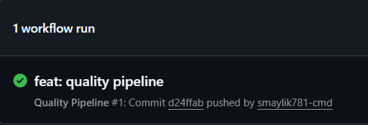
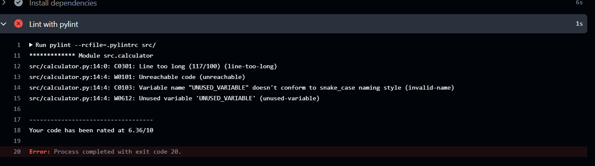
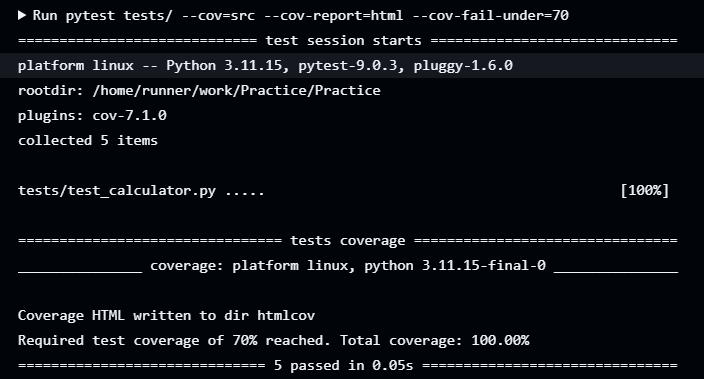

# Автоматизация контроля качества в CI/CD

## 2.a Реализованные этапы
1. **Статический анализ**: `pylint` с конфигом `.pylintrc`
   - Максимальная длина строки ≤ 100 символов
   - Запрещены неиспользуемые переменные и импорты
   - Quality Gate: `fail-under=7.0`
2. **Unit-тестирование**: `pytest`, 5 тестов, покрытие 100%
3. **Проверка покрытия**: `pytest-cov` с Quality Gate ≥70%
4. **Артефакты**: отчёт `htmlcov/` сохраняется в GitHub Actions через `actions/upload-artifact`

## 2.b Скриншоты запуска пайплайна
| Успешный запуск | Неудачный запуск |
|-----------------|------------------|
|  |  |

## 2.c Пример сработавшего Quality Gate
Добавлена неиспользуемая переменная с длинным именем → `pylint` снизил оценку до `6.36/10`. 
Так как в `.pylintrc` установлен `fail-under=7.0`, стадия `Lint` вернула код ошибки → весь пайплайн стал 🔴 красным. 
После удаления проблемного кода оценка поднялась выше 7.0, пайплайн восстановился автоматически.
| | |

## 2.d Вывод
Автоматизация позволила блокировать коммиты с низким качеством до их попадания в ветку без ручного вмешательства. 
Quality Gate гарантируют, что пайплайн падает при:
- покрытии тестами <70%
- оценке линтера <7.0
- нарушении стиля кода

**Трудности**: настройка порогов в `.pylintrc` и `quality.yml` для гарантированного падения пайплайна. Решение зафиксировано в конфигах.
